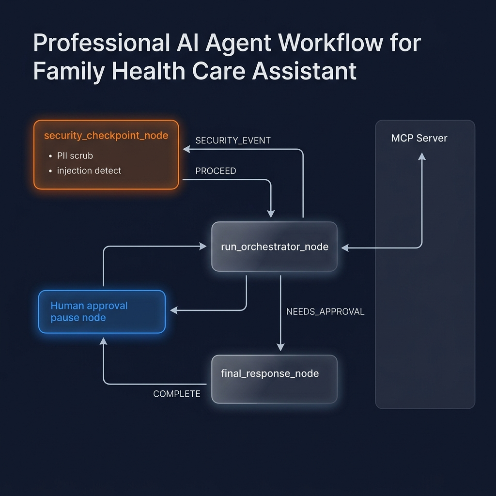
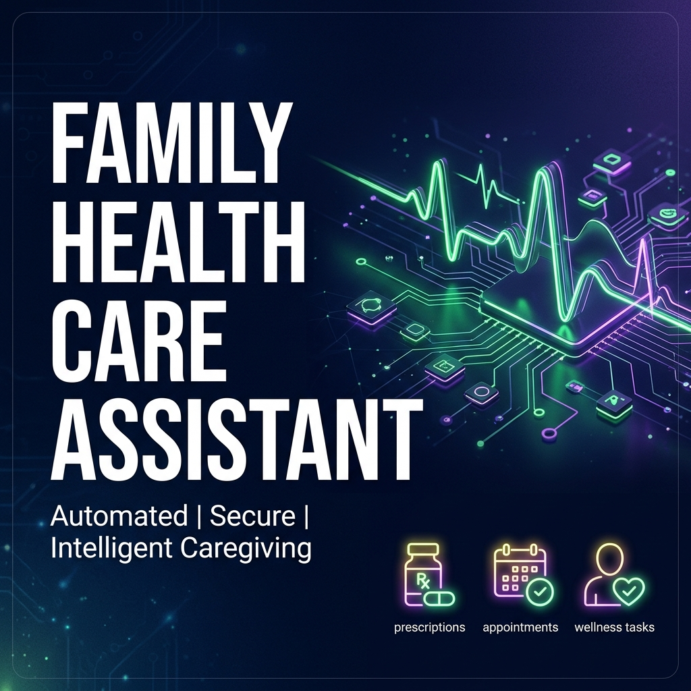

# Care Coordination Agent

Family health tracking & appointment scheduling assistant built with the Google ADK.

This agent helps caregivers manage complex family health schedules, track medications, and schedule appointments. It features offline fallbacks, human-in-the-loop (HITL) approval, and a persistent local database.

## Prerequisites

- **Python 3.11+**
- **uv** package manager
- **Gemini API key** (Get one at [aistudio.google.com/apikey](https://aistudio.google.com/apikey))

## Quick Start

```bash
git clone <repo-url>
cd care-coord
cp .env.example .env   # add your GOOGLE_API_KEY
make install
make playground        # opens UI at http://localhost:18081
```

## Architecture



## How to Run

```bash
make playground   # → interactive UI test
make run          # → local web server mode
```

## Sample Test Cases

Try these exact phrases in the Playground UI to test the core workflow:

### 1. Stage a Prescription
- **Input:** `log prescription Amoxicillin 500mg daily for Sarah`
- **Expected:** Bypasses LLM, matches offline prescription handler, stages the action, and pauses for caregiver approval.
- **Check:** The UI will respond with: "Please confirm this prescription... Reply YES to save it or NO to cancel."

### 2. Human Approval
- **Input:** `yes`
- **Expected:** The orchestrator captures the pending approval, saves the prescription to the persistent datastore, and confirms success.
- **Check:** The UI will respond with: "Approved! Prescription added..."

### 3. Retrieve Records
- **Input:** `health summary`
- **Expected:** Bypasses LLM entirely, reads directly from the persistent datastore, and formats a summary.
- **Check:** The UI will list active prescriptions (including the one just added) and scheduled appointments.

## Troubleshooting

1. **Error: `503 UNAVAILABLE` or `429 RESOURCE_EXHAUSTED`**
   - *Cause:* You hit the Gemini free-tier quota limits.
   - *Fix:* The core workflow (logging prescriptions/appointments, viewing summaries) works entirely offline and will still function! For open-ended chat, wait a few minutes for your quota to reset.

2. **Code changes in `agent.py` are not taking effect**
   - *Cause:* On Windows, the hot-reload feature for the web server conflicts with the event loop.
   - *Fix:* Stop the server (`Ctrl+C` or kill the process) and restart it manually: `uv run adk web app --host 127.0.0.1 --port 18081 --no-reload`

3. **Error: "No agents found" on startup**
   - *Cause:* The `adk web` command is looking in the wrong directory.
   - *Fix:* Ensure you are passing the correct source directory name (e.g., `app`) to the web command.

---

## Push to GitHub

1. Create a new repo at https://github.com/new
   - Name: care-coord
   - Visibility: Public or Private
   - Do NOT initialize with README (you already have one)

2. In your terminal, navigate into your project folder:
   ```bash
   cd care-coord
   git init
   git add .
   git commit -m "Initial commit: care-coord ADK agent"
   git branch -M main
   git remote add origin https://github.com/<your-username>/care-coord.git
   git push -u origin main
   ```

3. Verify `.gitignore` includes:
   ```
   .env          ← your API key — must NEVER be pushed
   .venv/
   __pycache__/
   *.pyc
   .adk/
   ```

⚠ **NEVER push `.env` to GitHub. Your API key will be exposed publicly.**

## Assets



## Demo Script

[View the Presentation Script](DEMO_SCRIPT.txt)
